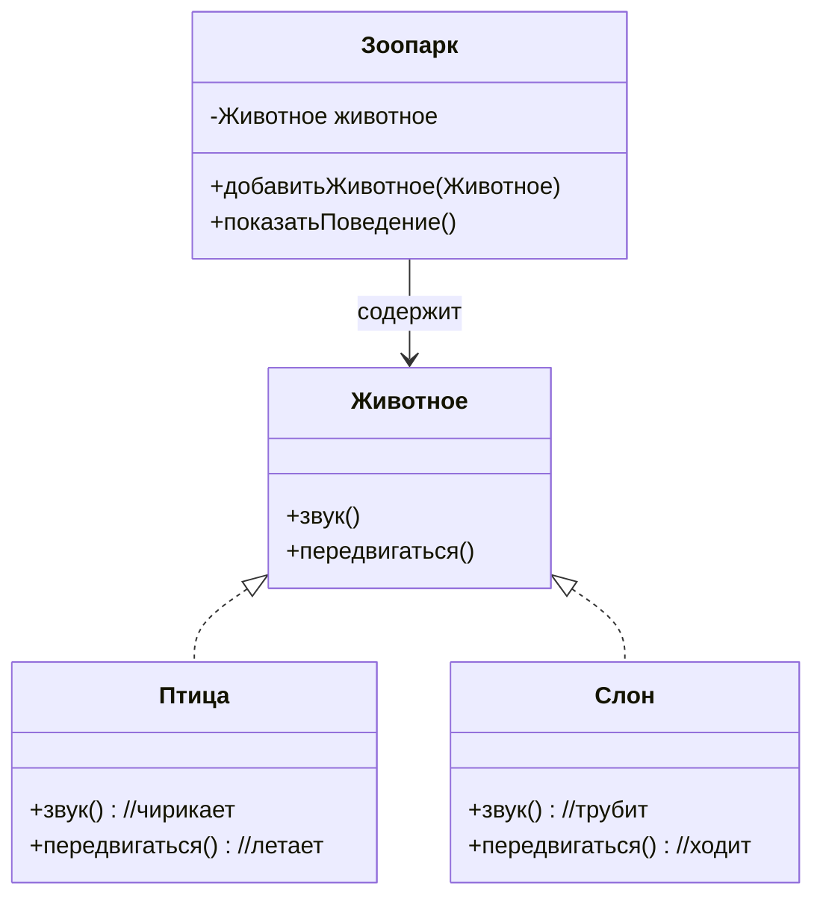
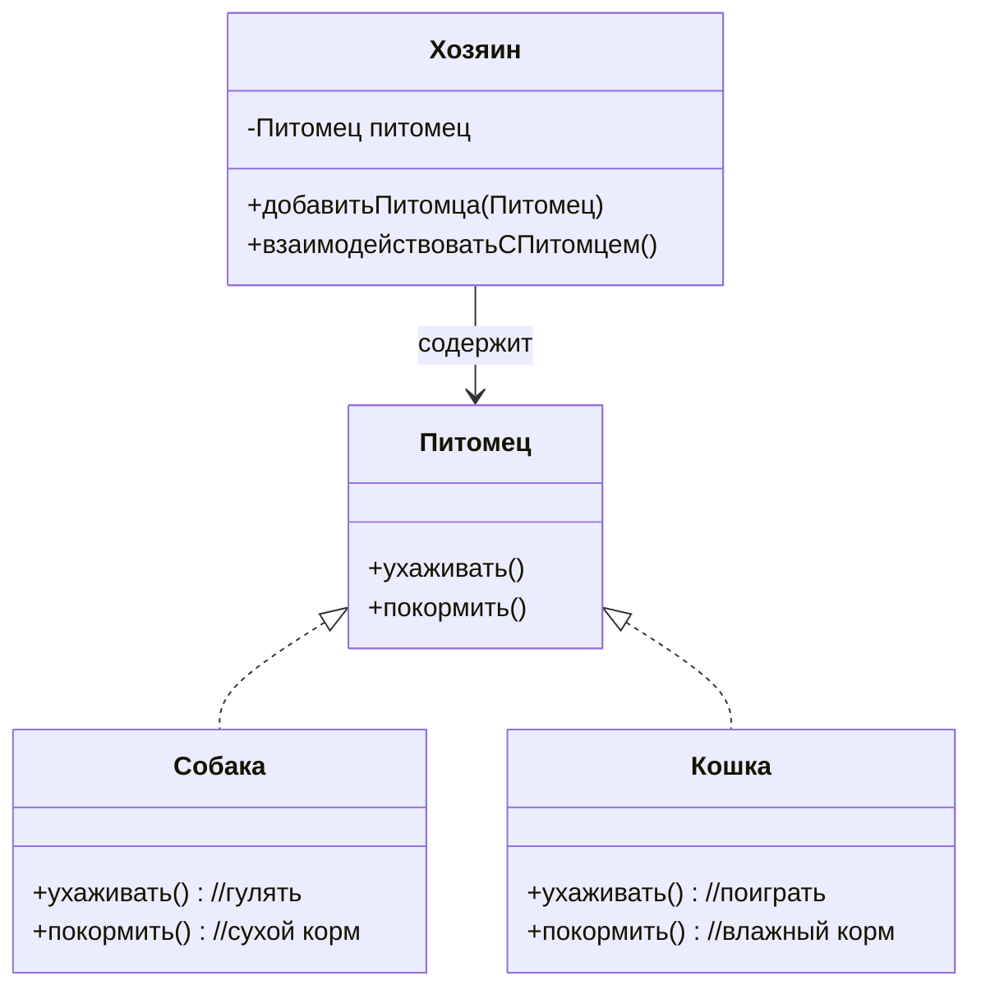
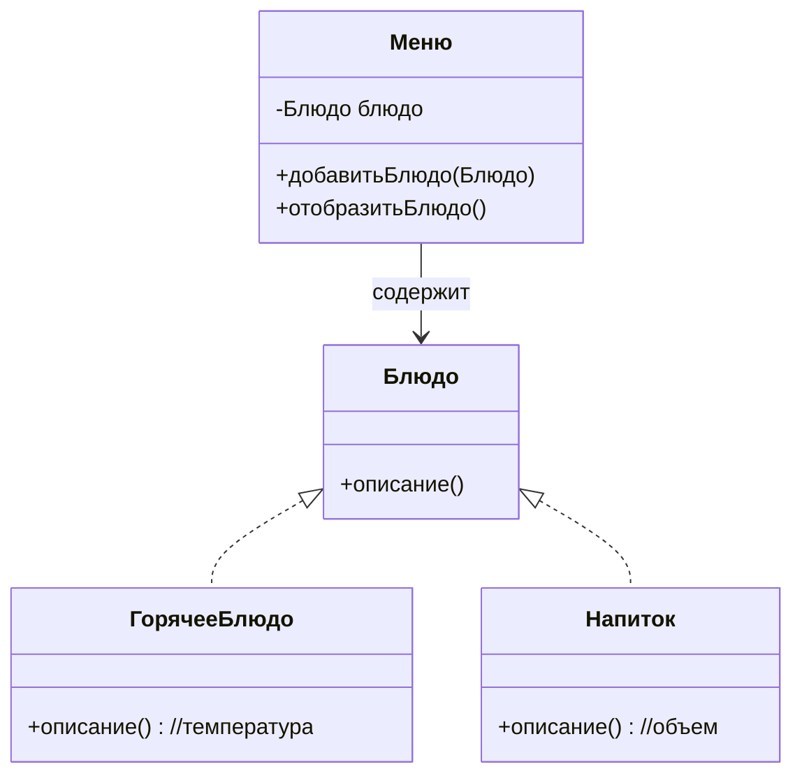
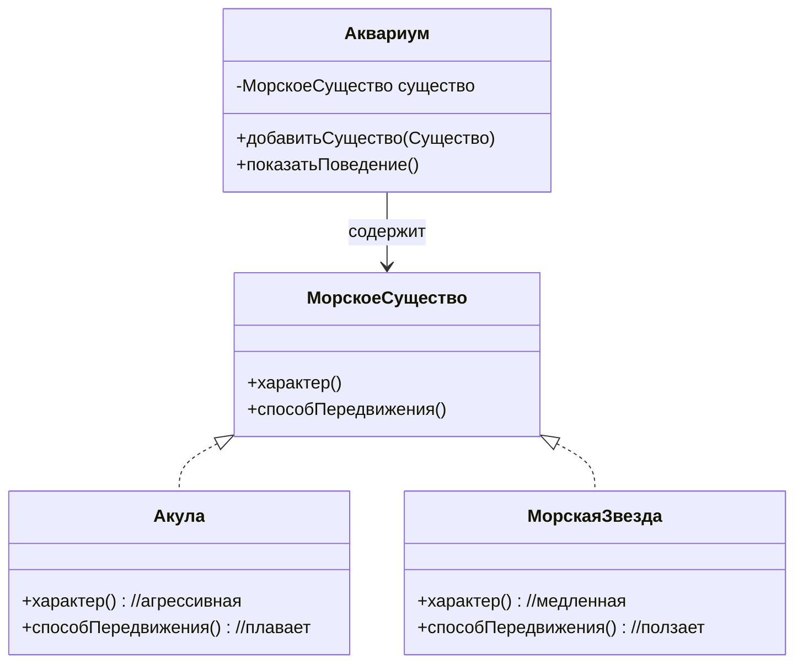
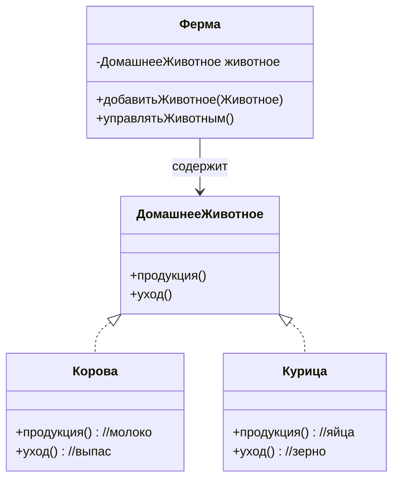
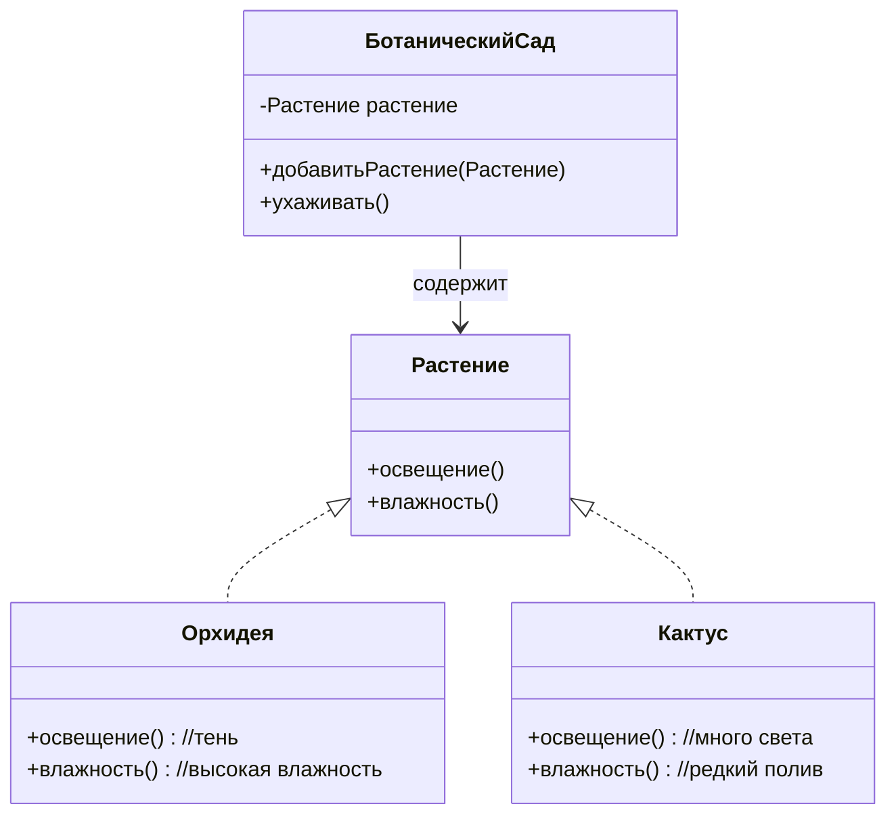
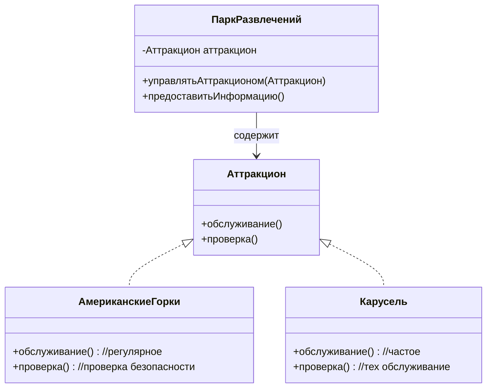
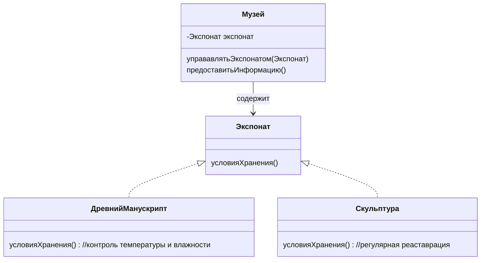

# 1 **Зоопарк**

## 1.1 Задача
В зоопарке содержится одно животное, которое может быть разного типа: птица или слон.  
Каждое животное издаёт уникальный звук и по-своему передвигается.  
Например:  

- Слон трубит и ходит
- Птица чирикает и летает

Нужно создать систему, в которую можно добавить любое животное и показать его поведение.

> [!hint]- Подсказка
> Введи базовый класс "Животное" с методами "издать звук" и "передвигаться". Создай его потомков: "Птица" и "Слон", которые реализуют уникальное поведение. Управлять ими будет класс "Зоопарк", который добавляет животных и демонстрирует их поведение.
> 
> 

## 1.2 Решение
### 1.2.1 Выделить сущности, свойства и действия

| Сущности | Свойства          | Действия                                          |
| -------- | ----------------- | ------------------------------------------------- |
| Зоопарк  | Животное животное | добавитьЖивотное(Животное) показатьПоведение() |
| Животное |                   | звук() передвигаться()                         |
| Слон     |                   | звук() //трубит передвигаться() //ходит        |
| Птица    |                   | звук() //чирикает передвигаться//летает        |
### 1.2.2 Определить связи
- Зоопарк-Животное - "имеет в составе", *агрегация*
- Животное-Слон, Животное-Птица - "is-a", *наследование*

## 1.3 Реализация

---
# 2 Управление домашними питомцами
## 2.1 Задача
В системе может быть один домашний питомец, причём каждый вид требует индивидуального ухода.
Примеры:
- Собака гуляет и ест сухой корм
- Кошка играет и ест влажный корм
Нужно создать систему, которая принимает любого питомца и позволяет взаимодействовать с ним с учётом его особенностей.

> [!hint]- Подсказка
> Определи общий класс "Питомец" с методами "уход" и "питание". От него унаследуй "Собаку" и "Кошку". Управлять питомцем будет класс "Хозяин", который взаимодействует с питомцем, учитывая его особенности.
> 
## 2.2 Решение
### 2.2.1 Выделить сущности, свойства и действия

| Сущности | Свойства        | Действия                                                 |
| -------- | --------------- | -------------------------------------------------------- |
| Хозяин   | Питомец питомец | добавитьПитомца(Питомец) взаимодействоватьСПитомцем() |
| Питомец  |                 | ухаживать() покормить()                               |
| Собака   |                 | ухаживать() // гулять покормить() //сухой корм        |
| Кошка    |                 | ухаживать() // играть покормить() //влажный корм      |
### 2.2.2 Определить связи
- Хозяин-Питомец - "содержит", *агрегация*
- Питомец-Собака, Питомец-Кошка - "is-a", *наследование*
## 2.3 Реализация

---
# 3 Управление рестораном
## 3.1 Задача
В ресторане может быть добавлено одно блюдо.
Каждое блюдо отображается по-своему в зависимости от типа:
- Горячее блюдо подаётся с указанием температуры
- Напиток — с указанием объёма
Нужно создать систему, которая добавляет блюдо в меню и выводит его описание с учётом особенностей.

> [!tip]- Подсказка
> Создай абстрактный класс "Блюдо" с методом "описание". Наследники "Горячее блюдо" и "Напиток" добавляют температуру и объём соответственно. Класс "Меню" управляет добавлением блюд и их отображением.
## 3.2 Решение
### 3.2.1 Выделить сущности, свойства и действия

| Сущности     | Свойства    | Действия                                  |
| ------------ | ----------- | ----------------------------------------- |
| Меню         | Блюдо блюдо | добавитьБлюдо(Блюдо) отобразитьБлюдо() |
| Блюдо        |             | описание()                                |
| ГорячееБлюдо |             | описание() //температура                  |
| Напиток      |             | описание() //объем                        |
### 3.2.2 Определить связи
- Меню-Блюдо - "содержит", *агрегация*
- Блюдо-ГорячееБлюдо, Блюдо-Напиток - "is-a", *наследование*
## 3.3 Реализация

---
# 4 Аквариум
## 4.1 Задача
В аквариуме находится одно морское существо, которое может быть разного типа.
У каждого существа уникальное поведение и способ передвижения.
Примеры:
- Акула плавает быстро и агрессивно
- Морская звезда ползает медленно по дну
Нужно создать систему, которая позволяет добавить существо в аквариум и демонстрировать его поведение.

> [!hint]- Подсказка
> Определи общий класс "Морское существо" с методом "движение". Наследники "Акула" и "Морская звезда" реализуют уникальные способы передвижения. Класс "Аквариум" отвечает за добавление существ и их демонстрацию.
## 4.2 Решение
### 4.2.1 Выделить сущности, свойства и действия

| Сущности        | Свойства                 | Действия                                                   |
| --------------- | ------------------------ | ---------------------------------------------------------- |
| Аквариум        | МорскоеСущество существо | добавитьСущество(Существо) показатьПоведение()          |
| МорскоеСущество |                          | характер() способПередвижения()                         |
| Акула           |                          | характер() //агрессивная способПередвижения() //плавает |
| МорскаяЗвезда   |                          | характер() //медленная способПередвижения() //ползает   |
### 4.2.2 Определить связи
- Аквариум-МорскоеСущество - "содержит", *агрегация*
- МорскоеСущество-Акула, МорскоеСущество-МорскаяЗвезда - "is-a", *наследование*
## 4.3 Реализация

---
# 5 Ферма
## 5.1 Задача
На ферме содержится одно домашнее животное.  
Каждое животное требует индивидуального ухода и выполняет свои функции.  
Примеры:  
- Корова даёт молоко и нуждается в выпасе
- Курица несёт яйца и требует корм с зерном
Нужно создать систему, которая управляет животным с учётом его потребностей.

> [!tip]- Подсказка
> Введи общий класс "Домашнее животное" с методами "продукция" и "уход". Наследники "Корова" и "Курица" переопределяют их поведение. Управляет животными класс "Ферма", который заботится о них и собирает продукцию.
## 5.2 Решение
### 5.2.1 Выделить сущности, свойства и действия

| Сущности         | Свойства                  | Действия                                          |
| ---------------- | ------------------------- | ------------------------------------------------- |
| Ферма            | ДомашнееЖивотное животное | добавитьЖивотное(Животное) управлятьЖивотным() |
| ДомашнееЖивотное |                           | продукция() уход()                             |
| Корова           |                           | продукция() //молоко уход() //выпас            |
| Курица           |                           | продукция() //яйца уход() //зерно              |
### 5.2.2 Определить связи
- Ферма-ДомашнееЖивотное - "содержит", *агрегация*
- ДомашнееЖивотное-Корова, ДомашнееЖивотное-Курица - "is-a", *наследование*
## 5.3 Реализация

---
# 6 Ботанический сад
## 6.1 Задача
В ботаническом саду содержится одно растение.
У разных видов растений разные требования по уходу.
Примеры:
- Орхидея нуждается в тени и высокой влажности
- Кактус требует много света и редкого полива
Нужно создать систему, которая добавляет растение в сад и обеспечивает необходимый уход.

> [!hint]- Подсказка
> Определи общий класс "Растение" с методом "уход". От него унаследуй "Орхидею" и "Кактус", указывая разные требования. Класс "Ботанический сад" управляет растениями, создавая подходящие условия.

## 6.2 Решение
### 6.2.1 Выделить сущности, свойства и действия

| Сущности        | Свойства           | Действия                                                  |
| --------------- | ------------------ | --------------------------------------------------------- |
| БотаническийСад | -Растение растение | +добавитьРастение(Растение) +ухаживать()               |
| Растение        |                    | +освещение() +влажность()                              |
| Орхидея         |                    | +освещение() //тень +влажность() //высокая влажность   |
| Кактус          |                    | +освещение() //много света +влажность() //редкий полив |
### 6.2.2 Определить связи
- БотаническийСад-Растение - "содержит", *агрегация*
- Растение-Орхидея, Растение-Кактус - "is-a", *наследование*
## 6.3 Реализация

---
# 7 Парк развлечений
## 7.1 Задача
В парке находится один аттракцион, каждый из которых имеет свои особенности:
- Американские горки требуют регулярной проверки безопасности
- Карусель — частого технического обслуживания
Нужно создать систему, которая управляет аттракционом и предоставляет информацию о нём для посетителей.

> [!hint]- Подсказка
> Создай базовый класс "Аттракцион" с методами "обслуживание" и "проверка". Наследники "Американские горки" и "Карусель" реализуют свои требования. Управляет ими класс "Парк", который следит за состоянием аттракционов.

## 7.2 Решение
### 7.2.1 Выделить сущности, свойства и действия

| Сущности          | Свойства              | Действия                                                          |
| ----------------- | --------------------- | ----------------------------------------------------------------- |
| ПаркРазвлечений   | Аттракцион аттракцион | управлятьАттракционом(Аттракцион) предоставитьИнформацию()     |
| Аттракцион        |                       | обслуживание() проверка()                                      |
| АмериканскиеГорки |                       | обслуживание() //регулярное проверка() //проверка безопасности |
| Карусель          |                       | обслуживание() //частое проверка() //тех обслуживание          |
### 7.2.2 Определить связи
- ПаркРазвлечений-Аттракцион - "содержит", *агрегация*
- Аттракцион-АмериканскиеГорки, Аттракцион-Карусель - "is-a", наследование
## 7.3 Реализация

---
# 8 Музей
## 8.1 Задача
В музее выставлен один экспонат. В зависимости от типа, экспонат имеет свою историю и требует особых условий хранения.
Примеры:
- Древний манускрипт нуждается в контроле температуры и влажности
- Скульптура требует регулярной реставрации
Нужно создать систему, которая управляет экспонатом и предоставляет информацию о нём для посетителей.

> [!hint]- Подсказка
> Определи общий класс "Экспонат" с методами "история" и "условия хранения". Наследники "Манускрипт" и "Скульптура" уточняют требования. Класс "Музей" управляет экспонатами и их презентацией.

## 8.2 Решение
### 8.2.1 Выделить сущности, свойства и действия

| Сущности          | Свойства          | Действия                                                    |
| ----------------- | ----------------- | ----------------------------------------------------------- |
| Музей             | Экспонат экспонат | управавлятьЭкспонатом(Экспонат) предоставитьИнформацию() |
| Экспонат          |                   | условияХранения()                                           |
| ДревнийМанускрипт |                   | условияХранения() //контроль температуры и влажности        |
| Скульптура        |                   | условияХранения() //регулярная реаставрация                 |
### 8.2.2 Определить связи
- Музей-Экспонат - "содержит", *агрегация*
- Экспонат-ДревнийМанускрипт, Экспонат-Скульптура - "is-a", *наследование*
## 8.3 Реализация

